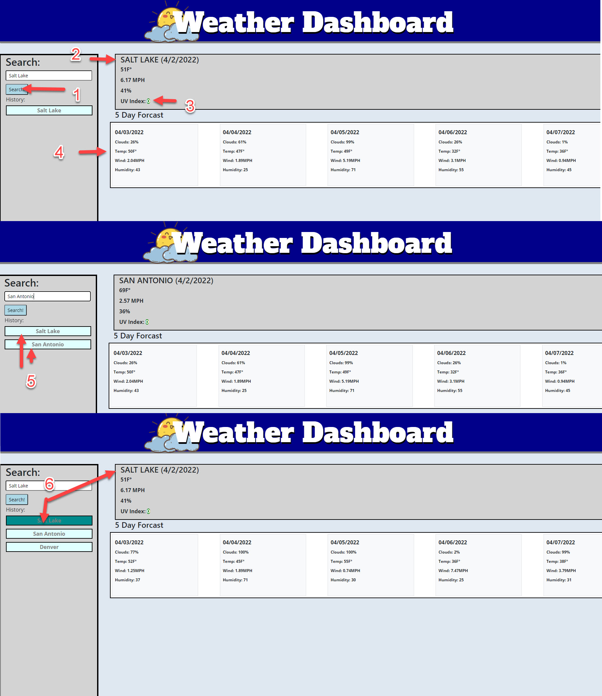

# Weather_Dashboard
This sixth homework assignment has me creating a weather dashboard using third-party API's.

- The motivation for myself is to demonstrate what I have learned over the last month and demonstrate that I have built on my ability to use fetch requests and can utilize third party apis.
- Through this assignment I became much more familiar with bootstrap once again, and also of course using fetch requests and apis in different ways.
- Overall I dont think the assignment was too hard, however projects started the same week that this assignment was being worked on so I found myself strapped for time. I will come back to this project and add finishing touches after projects are complete.

## Website can be viewed here:

- https://aurafly.github.io/Weather_Dashboard/

## Usage

1. The user may enter a city name and click 'Search!'.

2. Weather will be displayed at the top of the page.

3. Along with the weather, a UV index should be displayed and change from green to orange to red depending on the index.

4. Additionally, a 5 day forcast should be populated showing data every 24 hours for up til the 5th day.

5. Previously searched cities will be stored on the side of the page for future use.

6. If clicked, the previous cities will show their data once more.

## Credits
Jordan Covarrubias aka "AuraFly"
